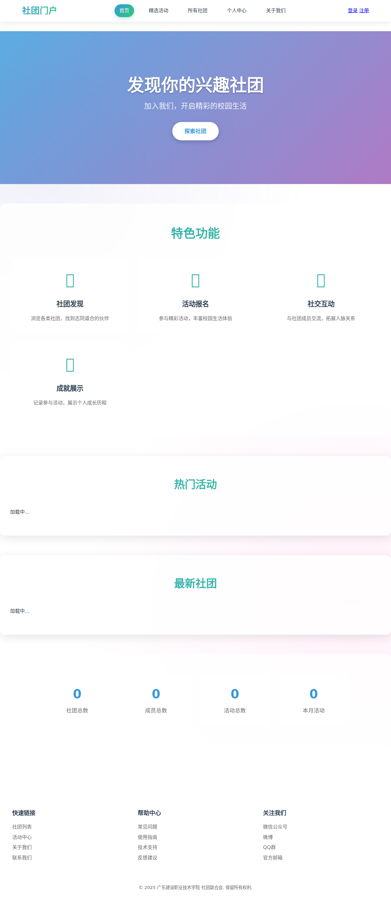
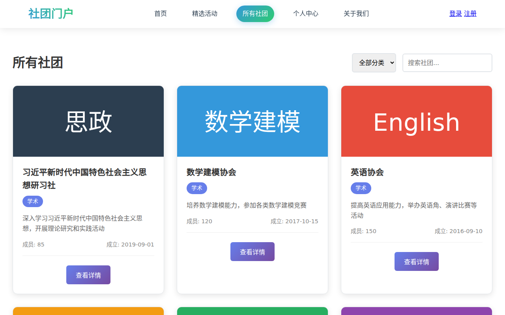
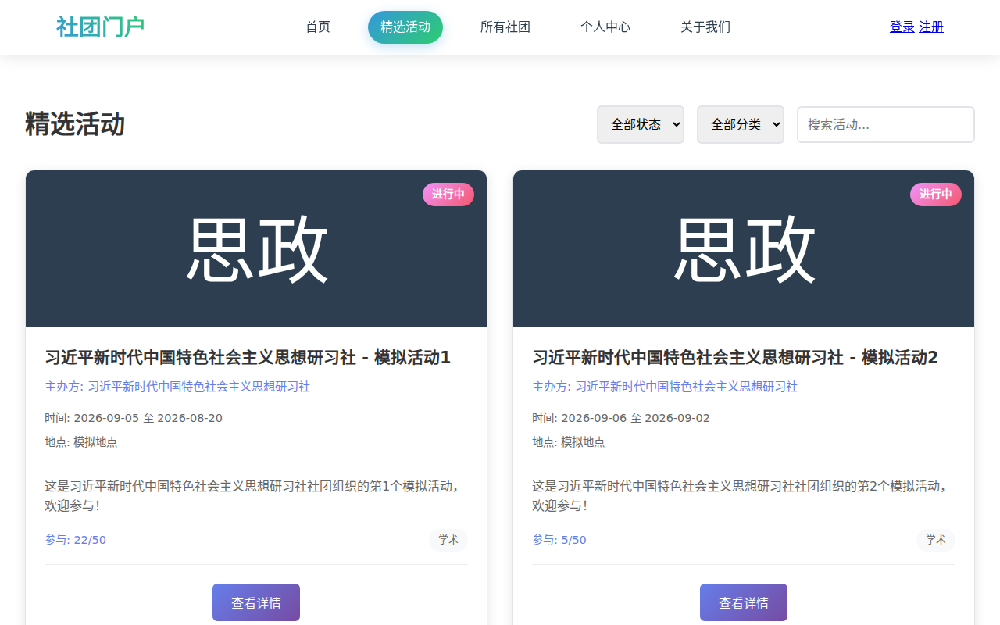
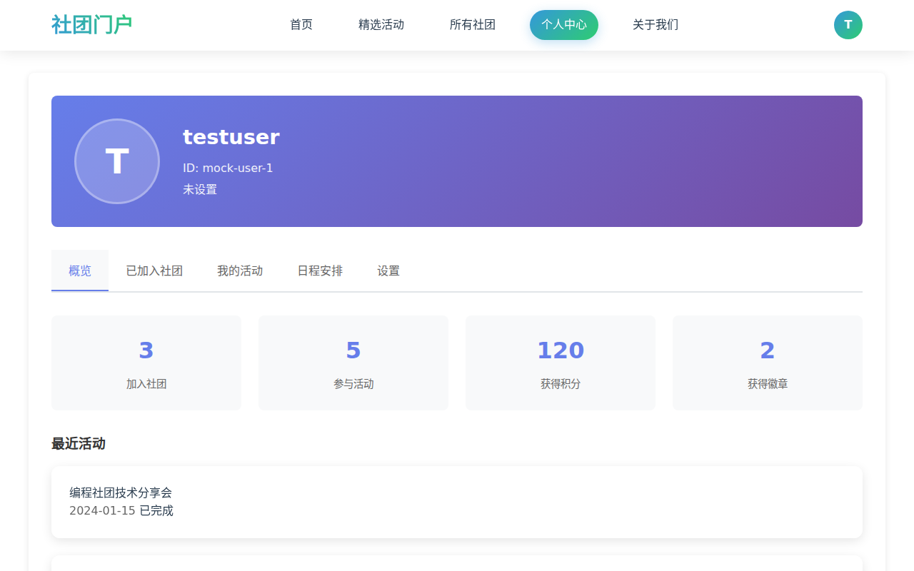
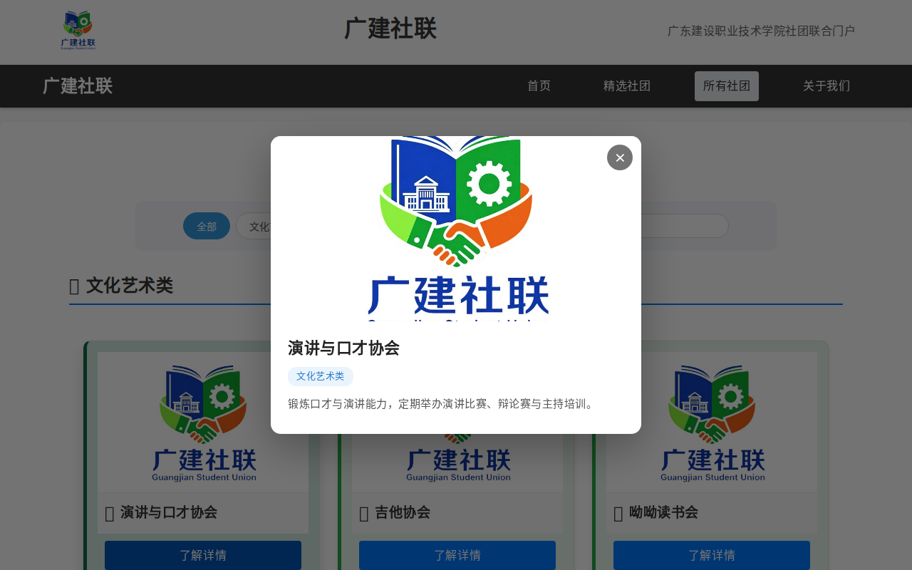
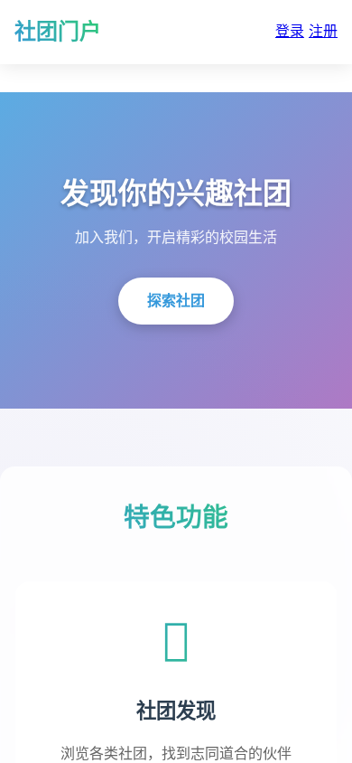

# 广东建设职业技术学院社团门户系统

> 大一 HTML/CSS/JavaScript 期末作业 · 社团联合会信息门户

一个面向广东建设职业技术学院的社团门户系统，提供**社团展示、活动发布、用户注册登录、个人中心**等完整功能模块。纯前端实现（HTML5 + CSS3 + JavaScript ES6），数据使用本地 JSON + 模拟 API 层，可平滑接入真实后端。


## 🖥️ 在线演示

项目已支持 GitHub Pages 部署：

- **主站（社团门户）**：`https://yangzicong2503416920.github.io/GuangDongConstructionPolytechnic_ClubsUnion/`
- **v1.0 原型**：`.../GuangDongConstructionPolytechnic_ClubsUnion/prototype/`

> 在仓库 Settings → Pages 中选择 `master` 分支即可启用。

## 📸 界面预览

| 首页 | 社团列表 |
| --- | --- |
|  |  |

| 活动列表 | 个人中心 |
| --- | --- |
|  |  |

| v1.0 原型 · 精选轮播 | v1.0 原型 · 社团详情 |
| --- | --- |
|  |  |

| 移动端适配 |
| --- |
|  |

## ✨ 功能特性

- **社团展示**：社团列表 + 分类筛选 + 搜索（原型版另含 4 大分类筛选与名称搜索）
- **活动管理**：活动发布、活动详情、一键报名、报名状态跟踪
- **用户系统**：注册（表单校验）、登录（设备 ID 自动登录 + 记住我）、忘记密码（验证码倒计时重置）
- **个人中心**：数据概览、已加入社团、我的活动、日程安排、设置
- **响应式设计**：完美适配桌面端与移动端
- **模块化架构**：JavaScript 模块化组织 + CSS 组件化设计（base/layout/components/pages）

## 📁 项目结构

```
├── index.html / activities.html / clubs.html ...
├── css/            # base + layout + components + pages
├── js/             # core（api/auth/cache/utils）+ pages + main
├── data/           # clubs.json / activities.json（本地模拟数据）
├── assets/images/  # 图片资源
├── prototype/      # v1.0 原型版（独立子站点：轮播、社团详情模态框等）
└── docs/           # 项目文档 + 界面截图
```

> 详细结构说明见 [docs/README.md](docs/README.md)

## 🚀 快速开始

1. 克隆仓库或下载 ZIP
2. 用本地 HTTP 服务器打开（如 `python3 -m http.server`），或部署到任意静态托管平台
3. 使用测试账号登录体验全部功能

**测试账号**：`testuser / 123456`、`admin / admin123`、`student / student123`

## 🧪 质量验证

项目通过 Playwright 自动化冒烟测试：**14 个页面零控制台报错**，核心交互（登录、注册、找回密码、社团筛选、详情模态框、轮播暂停/播放）全部通过。

## 📚 文档

| 文档 | 说明 |
| --- | --- |
| [docs/README.md](docs/README.md) | 完整项目文档（结构、功能、开发规范） |
| [docs/CHANGELOG.md](docs/CHANGELOG.md) | 版本变更日志 |
| [prototype/README.md](prototype/README.md) | v1.0 原型版说明 |

## 📦 版本信息

- 当前版本：**v2.2.0**
- 历史版本：v1.0.0 → v2.2.0（见 [CHANGELOG.md](docs/CHANGELOG.md)）

## 📄 许可证

[MIT License](LICENSE)
